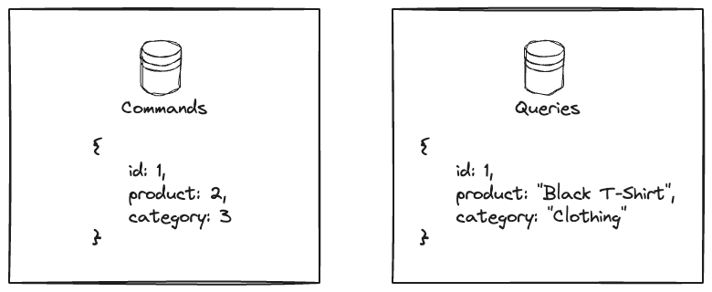

# Event Driven Architecture

Event-driven architecture (EDA) is a software design paradigm in which the flow of the program is determined by events, which are changes in state or updates that occur within the system. In EDA, components communicate primarily through the production, detection, and consumption of events. This architecture allows for asynchronous communication, enabling systems to respond to real-time events as they occur, rather than relying on a pre-defined sequence of actions. EDA is particularly well-suited for applications that require high levels of scalability, flexibility, and responsiveness, such as real-time data processing, microservices, microfrontends and distributed systems.

## Even types

Events can be classified into several different types based on their source, timing, and purpose. Some common types of events in EDA include:

- **Notification events**: These events are used to notify other components of changes in state or updates that have occurred within the system. For example, a component may emit a notification event when a order is placed.

- **Carried State Transfer events**: These events are used to transfer state information between components. For example, a component may emit a state transfer event to share data with another component. It is similar to a notification event, but it carries additional and more detailed information.

But if you dive into Domain Drive Design (DDD) for example, there is also the concept of Domain Events, which are events that are relevant to the domain of the application. Therefore, don't be surprised if you see different types of events in different contexts.

## Event sourcing

Event sourcing is a design pattern that is often used in conjunction with EDA. In event sourcing, the state of the system is determined by a sequence of events that have occurred within the system. Instead of storing the current state of the system, event sourcing stores a log of events that have occurred, which can be used to reconstruct the state of the system at any point in time. This approach has several advantages, including improved auditability, scalability, and fault tolerance. But it also has some drawbacks, such as increased complexity and the need for additional infrastructure to manage the event log.

## Event collaboration

Event Collaboration, [as described by Martin Fowler](https://martinfowler.com/eaaDev/EventCollaboration.html), emphasizes the communication and interaction between objects in a system through events rather than direct method calls. This pattern centers around objects broadcasting events when they change state, allowing other interested objects to react to these events rather than querying or directly invoking methods on each other. This decouples the objects, promoting flexibility and enhancing maintainability by reducing dependencies. Event Collaboration encourages a more loosely coupled architecture where objects can communicate asynchronously, reacting to events they are interested in, which in turn fosters modularity and extensibility within software systems.

## Command Query Responsibility Segregation (CQRS)

CQRS is a design pattern that is also often used in conjunction with EDA. In CQRS, the system is divided into two parts: **the command side** and **the query side**. The command side is responsible for handling commands that change the state of the system, while the query side is responsible for handling queries that retrieve data from the system. This separation allows for the optimization of each side independently, enabling the system to scale more effectively and handle a higher volume of requests. CQRS is particularly well-suited for applications that require high levels of scalability and performance, such as real-time data processing and analytics.

This separation of concerns allows us also to have the data stored separately, which can be useful for different purposes. For example, we can have one database for the command side, which is optimized for write operations, and another database for the query side, which is optimized for read operations. This can help to improve the performance of the system and provide a better user experience.



Greg Young, who is one of the main proponents of CQRS, has a great talk on this topic, which you can watch [here](https://www.youtube.com/watch?v=JHGkaShoyNs).

## Unit of Work (UoW)

Unit of Work is a design pattern where the system is divided into units of work, each of which is responsible for handling a specific set of operations. These units of work can then be combined to form a larger unit of work, which is responsible for coordinating the execution of the individual units of work. This pattern helps to ensure that the system remains consistent and that changes are applied atomically, meaning that they are either all applied or none are applied.

You can find an example of implementation of the Unit of Work pattern in the [`./wallet-core/package/uow/uow.go`](./wallet-core/package/uow/uow.go) file. 

## Running Locally

1. Clone this repo
1. Run `docker compose up -d` on the root folder

## Testing the application

### Create clients

The request below creates a client and returns the client ID. You will need this ID to create an account.

```bash
curl --location 'http://localhost:3000/clients' \
--header 'Content-Type: application/json' \
--data-raw '{
    "name": "John Doe",
    "email": "john@doe.com"
}'
```

### Create accounts

The request below creates an account and returns the account ID. You will need this ID to create a transaction.

```bash
curl --location 'http://localhost:3000/accounts' \
--header 'Content-Type: application/json' \
--data '{
    "client_id": "Client ID returned from the previous request"
}'
```

### Create a transaction between two accounts

The request below creates a transaction between two accounts. The amount is the value that will be transferred from the account with the ID `account_id_from` to the account with the ID `account_id_to`.

```bash
curl --location 'http://localhost:3000/transactions' \
--header 'Content-Type: application/json' \
--data '{
    "account_id_from": "Account id from",
    "account_id_to": "Account id to",
    "amount": 100
}'
```

## Useful SQL queries

Below you will find useful SQL queries to check the side effects of the requests you made. You can run these by connecting to the database container and running the `mysql -u root -p wallet` command and entering the `root` password. 

### List clients

```sql
SELECT * FROM clients;
```

### List accounts

```sql
SELECT * FROM accounts;
```

### List transactions

```sql
SELECT * FROM transactions;
```

### Add balance to an account

```sql
UPDATE accounts SET balance = 1000 WHERE id = 'Account ID';
```


